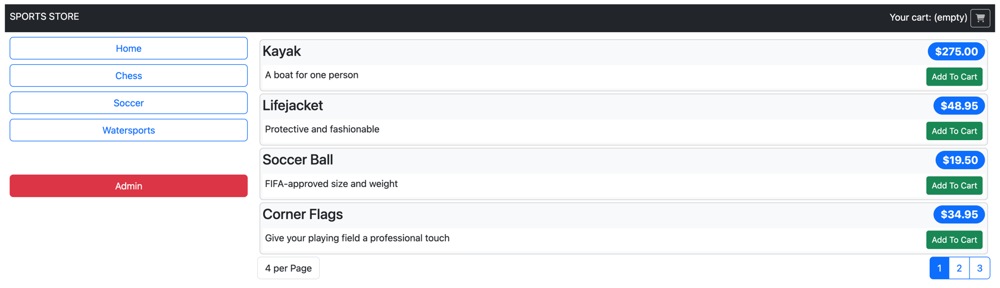

# Autoformation d'Angular via "Pro Angular 16"

Ce dépôt est un fork personnel du code source du livre "Pro Angular 16" par Adam Freeman. Les exemples originaux étant développés avec Angular 16, j'ai entrepris de les mettre à jour vers Angular 19. Ce projet me sert de support pour une montée en compétence pratique sur les dernières versions du framework.

## 🎯 Objectif

En tant que développeur confirmé spécialisé dans le back, j'ai créé ce fork pour apprendre les bases d'angular afin d'enrichir ma panoplie de compétences.

## 🛠️ Concepts Étudiés

Ce projet couvre les piliers du développement Angular moderne :

* **Architecture :** Standalone Components, Modules, Services et Injection de Dépendances (DI).
* **Fondamentaux :** Data Binding, Directives, et Pipes.
* **Programmation Réactive :** Utilisation de RxJS pour la gestion des états et des événements asynchrones.
* **Navigation :** Routage avancé, incluant les Route Guards et les Resolvers.
* **Formulaires :** Maîtrise des Reactive Forms pour la gestion de données complexes.
* **Communication :** Intégration d'API REST avec `HttpClientModule`.
* **Tests :** Pratiques de tests unitaires et d'intégration (Jasmine & Karma).

## Projet réalisé
Application web angular pour gestion d'un magasin de produits sportifs


## 🚀 Démarrage du projet

Chaque dossier correspond à un projet ou à un chapitre du livre.

1.  **Cloner le dépôt :**
    ```bash
    git clone [https://github.com/iliassaek/pro-angular-16.git](https://github.com/iliassaek/pro-angular-16.git)
    ```

2.  **Naviguer vers un projet :**

    ```bash
    cd chapter08/SportsStore
    ```

3.  **Installer les dépendances et lancer :**
    ```bash
    npm install && ng serve
    ```
    ```bash
    npm run json
    ```

4.  **Accéder à l'application :** `http://localhost:4200`
